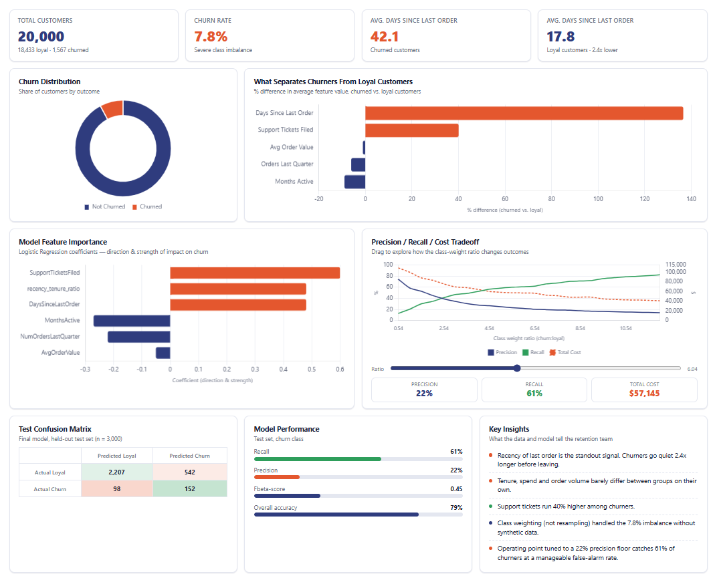

# Customer Churn Early-Warning Model — UrbanCart

## 1. The Problem

The Retention Team noticed that customers were **going quiet** and leaving without any warning. By the time monthly reports showed a customer as churned, it was already too late to do anything about it.

My Job as the ML Engineer was to build something that flags at-risk customers *before* they fully leave, using data UrbanCart already collects on every account.

---
Try out the app here: https://urbancart-customer-churn.streamlit.app/
Check the interactive dashboard here: https://github.com/obinna-Muonanu/TeSA-AI-Specialization-Assignment-III/blob/main/UrbanCart_Churn_Dashboard.html

## 2. The Data

I was given records for about 20,000 customers, with five pieces of information tracked for each one:

- **MonthsActive** – how long they've been a customer
- **AvgOrderValue** – how much they typically spend per order
- **NumOrdersLastQuarter** – how many orders they placed recently
- **DaysSinceLastOrder** – how long it's been since their last order
- **SupportTicketsFiled** – how many support complaints they've filed
- **Churned** – whether they actually stopped ordering (this is the target feature)

**Important fact about the data:** only about 8% of customers in the dataset actually churned. The other 92% are loyal customers. This imbalance turned out to be the single most important thing to design around.

---

## 3. Why "How Often Is the Model Right?" Is the Wrong Question

The most obvious way to grade a model is accuracy, how many predictions did it get right overall? For this problem, that measure is misleading and would actually hide a badly broken model.

Since 92% of customers don't churn, a model could simply guess **this customer will NOT churn** for every single person, get it right 92% of the time, and look excellent on paper, while being completely useless. It would never catch a single at-risk customer, which is the entire point of this project.

Because of this, I did not use overall accuracy to judge success. Instead, I used metrics that specifically measure how well the model finds the churners.

## 4. What Was Measured Instead, and Why

I looked at two mistakes a model can make, and treated them very differently:

- **Missing a churner (false negative):** the model says a customer is fine, but they actually leave. This is expensive as that customer's future revenue is gone, and there was no chance to step in.
- **Wrongly flagging a loyal customer (false alarm / false positive):** the model says a customer is at risk, but they were never planning to leave. This is cheap by comparison, worst case scenario, the team sends them an unnecessary discount or check-in message.

Because missing a real churner costs far more than a false alarm, I deliberately built the model to **prioritize catching churners (recall)**, even if that means accepting a fair number of false alarms along the way. I also set a limit that the retention team can only realistically act on alerts if at least 1 in 5 (20%) turn out to be real, otherwise the alerts become noise nobody trusts. Every tuning decision respected that 20% floor.

## 5. What I Found in the Data

Before building any model, I looked at what actually separates customers who churn from those who don't:

- **Only one signal stood out clearly:** how long it's been since a customer's last order. Customers who eventually churned had, on average, gone noticeably longer without ordering.
- **The other four features on their own barely mattered.** How long someone has been a customer, how much they typically spend, how many orders they placed recently, and how many support tickets they filed all looked nearly identical between churners and loyal customers.

This finding is useful because it tells the retention team that "long-time customer," "big spender," and "recent order volume" are **not** reliable warning signs by themselves. Recency of ordering is.

## 6. Models Built

I built and compared two different models:

1. **Logistic Regression** — a simple, transparent model, adjusted so it pays much more attention to churn cases despite them being rare in the data.
2. **XGBoost** — a more complex, tree-based model, tuned the same way for fairness of comparison.

Both models were trained only on a training portion of the data, then checked against a separate validation set (used for evaluating tuning) and a completely untouched test set (used for the final report). This keeps the evaluation honest and the model is never graded on data it already learned from.

**Result:** Logistic Regression performed better for this problem. It caught more churners at the same false-alarm rate the team can tolerate. So it is the recommended model. XGBoost was not far off, its under-performance might be due to the small feature set in the data

## 7. Final Results

Numbers below are for identifying customers who churn, on data the model had never seen before (the test set):

| Metric | Meaning in plain terms | Result |
|---|---|---|
| Precision | Of the customers flagged as at-risk, how many really were | 22% |
| Recall | Of the customers who actually churned, how many the model caught | 61% |
| Overall accuracy | (Not the right measure here, just included only for reference) | 79% |

In practical terms: out of every 250 customers who actually churn, the model correctly flags around 150 of them. To do that, it also flags roughly 550 loyal customers out of 2,750 as a false alarm. That trade-off was deliberate as it reflects that catching real churners is worth some extra, low-cost false alarms.

## 8. Recommendation

I recommend using the **Logistic Regression model** as the churn early-warning system, with alerts sent to the retention team whenever a customer's risk score crosses the chosen threshold.

## 9. Limitations and What to Watch

- The costs used to guide these decisions ($500 assumed loss per missed churner, $15 assumed cost per false alarm) were **assumed estimates for this problem**.
- The model relies heavily on one signal (days since last order). If UrbanCart's business changes, for example, customers naturally order less often for a legitimate reason. This model should be re-checked, since its main signal could become less reliable.
- This model flags risk; it does not explain *why* a specific customer is at risk. Pairing it with the retention team's judgment is still important.

---
